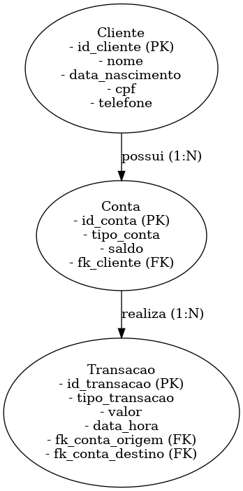

# compass-desafio-03
## Desafio 03 proposto pela Compass para desenvolver uma aplicação Java que escaneia as interações do usuário com o terminal para realizar comandos

# 💻 Rodar a aplicação na sua máquina 💻

### Você vai precisar ter instalado

- [Git](https://git-scm.com/downloads)
- [jdk:17](https://www.oracle.com/java/technologies/javase/jdk17-archive-downloads.html)
- [maven](https://maven.apache.org/download.cgi)
- [IDE de sua preferência]

<details>
<summary>Instruções</summary>

## Clonar o repositório

Primeiramente você vai precisar clonar este repositório para qualquer diretório em sua máquina local.

Para isso você vai executar o seguinte comando no seu terminal:

```console
git clone https://github.com/fernandosenacruz/compass-desafio-03
```

## Setup

Antes de inicializar o projeto, é importante configurar algumas variáveis de ambiente (.env.example) e instalar as dependências do projeto.

### Configurar o ambiente (.env)

- **Root**
  - Acesse o diretório `./compass-desafio-03`
  - Crie o arquivo `.env` com as variáveis de ambiente indicadas:
  ```
  DB_USERNAME=your_user
  DB_PASSWORD=your_password
  DB_URL=jdbc:mysql://localhost:3306/db_name
  ```

## Acessar a Aplicação

</details>

### Instalar dependências

- Na pastas`./compass-desafio-03` rode o comando `mvn clean install`

## Inicializar a Aplicação

- Com uso da IDE rode a aplicação na classe App

</details>

## Modelo ER do DB



## Tecnologias Usadas

### Banco de Dados 💾

- [MySql](https://www.mysql.com/downloads/)

### Back-end ⚙️

- [Hibernate](https://hibernate.org/)


</details>
